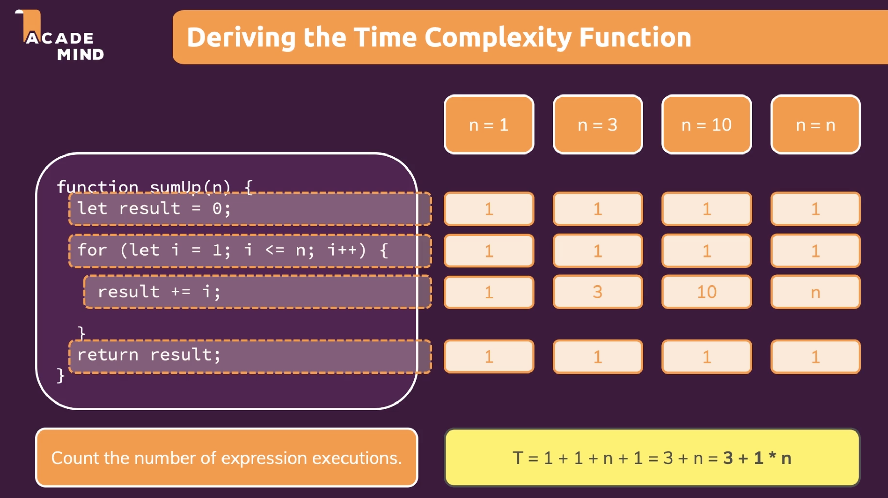

# Big O

[Big O Measuring Performance](https://www.geeksforgeeks.org/understanding-time-complexity-simple-examples/ "Big O Measuring Performance")

## Measuring Performance (Time Complexity)
- **O(n^2)**: You ask the first person of the class if they have the pen, then you ask this person about the other 99 people in the classroom if they have that pen.

- **O(n)**: Going and asking each student individually.

- **O(log n)**: I divide the class into two groups. I ask if the pen is on the left or the right side of the classroom. Then I take that group and divide that group into two and ask again, and so on until I'm left with one person who has the pen.

## Deriving Big O (Asymptotic Analysis)
1. Define the function
    - count the number of expression executions
    - T = a * n + b
2. Find the fasted growing term
    - T = **a*n** + b
3. Remove the coefficient
    - T = n

## Using Big O to Compare Algorithms

## Identifying Big O Quickly
- O(n): Higher n leads to a linear increase in runtime => Look for (single) loops
- O(1): Higher n does not affect runtime => Look for functions without loops and witout any function calls

## Bitwise Operators
![Bitwise Operators][https://www.geeksforgeeks.org/javascript-bitwise-operators/]

![Bitwise Numbers][https://www.khanacademy.org/computing/computers-and-internet/xcae6f4a7ff015e7d:digital-information/xcae6f4a7ff015e7d:binary-numbers/a/bits-and-binary]

### Powers of Two
- 2^2 = 2
- 2^3 = 4
- 2^4 = 8
- 2^5 = 32
- 2^6 = 64
- 2^7 = 128
- 2^8 = 256

# JavaScript Functions and Methods

#### forEach()
- calls a function once for each element in an array, in order.
- another way of looping through an array

#### .filter()
- creates an array filled with all array elements that pass a test
- array.filter(callback(element, index, arr), thisValue)
- callback: holds the function to be called for each of element of the array
- element: holds the value of the elements being processed currently.
- index: optional, holds the index of the currentValue element in the array starting from 0
- arr: optional, holds the complete array on which array.every is called
- thisValue: optional, holds the context to be passed as this to be used while executing the callback function.

#### .replace()
- searches a string for a specified value and returns a new string where the specified values are replaced

#### .reduce()
- array.reduce((total, amount) => total + amount)
- used to apply a function to each element in the array to reduce the array to a single value

#### .includes()
- array.includes(valueToSearchFor, fromIndex)
- available for arrays and strings
- will check if an array or string includes the specific value that was provided.
- returns a boolean: true if it includes, flase if it doesn't

#### .map()

#### .every()
- checks if all elements in an array pass a test (provided as a function)
- executes the function once for each element present in the array
    - if it finds an array element where the function returns a false value, every() returns false and does not check the remaining values
    - if no false occur, every() returns true

#### .has()
- How to check if an element is in a set

### .sort()
- sorts the items of an array
- can be alphabetic or numeric sort, either ascending or descending
- by default, it sorts value as strings in alphabetical and ascending order

## Set

#### new Set()
- When values are passed to the Set function, they remain unique.
- Repeating values are removed.
- Contains only distinct elements/objects with no need of being allocated by index
- Considered as "keyed collection"

#### add()
- Set needs to check through all members to make sure there won't be any duplicates
- Generally takes O(n) running time

#### size()
- returns the number of unique elements in a Set.

#### has()
- Returns a boolean indicating if an element with specified value exists in the Set

#### delete()
- Removes a specific given element from Set.

#### clear()
- Removes all elements from Set.

## Map

#### new Map()
- any type of key is possible
- can also use objects as keys

#### .set(key, value)
- stores the value by the key

#### .get(key)
- returns the value by the key, undefined if key doesn't exist in map.

#### .has(key)
- returns true if th key exists, false otherwise.

#### .delete(key)
- removes the value by the key

#### .clear()
- removes everything from the map

#### .size
- returns the current element count

#### .forEach()
- runs the function for each (key, value) pair

### Iteration over Map

#### map.keys()
- returns an iterable for keys

#### map.values()
- returns an iterable for values

#### map.entries()
- returns an iterable for entries [key, value], it's used by default in for...of

## Object Properties

### Object.entries()
- takes an object as an argument and returns an array with arrays of key-value pairs

### Object.values()
- takes an object as an argument but only returns the values
